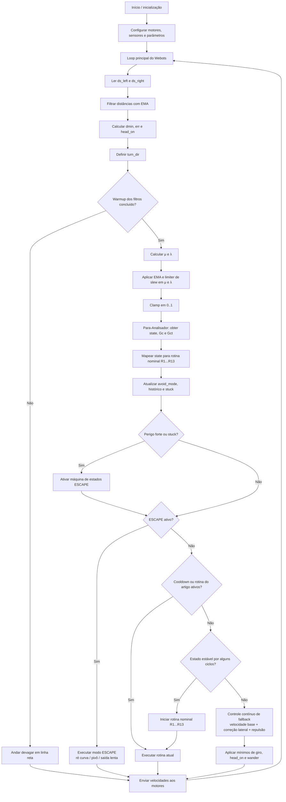

# Exemplo de Aplicação: Robô Emmy – Parte 1 (Webots)

Implementação em **Webots** do exemplo **“Exemplo de Aplicação: Robô Emmy – Parte 1”**, associado ao **Capítulo 1 – Para-analisadores** do livro *Aplicações de LPA2v*.

Este repositório reúne a versão computacional do exemplo, incluindo:

- o mundo principal no Webots;
- o controlador `drive_my_robot.py`;
- a organização do projeto para publicação e reaproveitamento em outros exemplos do livro;
- uma documentação que conecta a implementação ao fluxo lógico oficial do capítulo.

---

## Nome oficial do repositório

```text
livro-aplic-lpa2v-cap01-robo-emmy-parte1-webots
```

Este repositório foi pensado como **um exemplo individual dentro de uma coleção maior de repositórios do livro**.

Padrão sugerido para os próximos exemplos:

```text
livro-aplic-lpa2v-capXX-nome-do-exemplo-parteY-tecnologia
```

---

## Objetivo do exemplo

O objetivo deste projeto é mostrar, em ambiente simulado, como uma lógica inspirada no **Robô Emmy** pode ser implementada no **Webots** a partir de uma estrutura baseada em:

1. leitura e filtragem de sensores;
2. construção de grandezas intermediárias do ambiente;
3. obtenção de graus de evidência `μ` e `λ`;
4. avaliação por um **Para-Analisador LPA2v**;
5. seleção de rotinas motoras coerentes com o estado lógico identificado;
6. uso de camadas adicionais de robustez, como `escape`, `cooldown`, detecção de `stuck` e fallback contínuo.

Em termos conceituais, esta implementação é uma **releitura didática em Webots**, preservando o núcleo lógico do exemplo do livro e convertendo esse fluxo em uma arquitetura executável de controle robótico.

---

## Arquivos principais

### Controlador principal

```text
controllers/drive_my_robot/drive_my_robot.py
```

Esse arquivo concentra a lógica do robô, incluindo:

- leitura dos sensores laterais;
- filtragem das distâncias;
- cálculo de variáveis intermediárias, como `dmin`, `err` e `head_on`;
- geração e suavização de `μ` e `λ`;
- chamada do Para-Analisador;
- mapeamento do estado lógico para rotinas nominais;
- tratamento de `avoid_mode`, `escape`, `cooldown` e fallback.

### Mundo principal

```text
worlds/empty_emmy_v15_fov180.wbt
```

Esse é o cenário principal para execução do exemplo no Webots.

---

## Estrutura do repositório

```text
.
├── controllers/
│   └── drive_my_robot/
│       └── drive_my_robot.py
├── worlds/
│   └── empty_emmy_v15_fov180.wbt
├── libraries/
├── plugins/
├── protos/
├── docs/
├── assets/
├── .github/
├── README.md
├── LICENSE
├── CITATION.cff
├── CONTRIBUTING.md
├── CODE_OF_CONDUCT.md
├── SECURITY.md
├── CHANGELOG.md
├── .gitignore
└── IMPORTAR_NO_GITHUB.md
```

---

## Como executar

### 1. Abrir o mundo no Webots

Abra o arquivo:

```text
worlds/empty_emmy_v15_fov180.wbt
```

### 2. Conferir o controlador do robô

O mundo já está preparado para usar:

```text
controller "drive_my_robot"
```

### 3. Executar a simulação

Ao iniciar a simulação, o console do controlador deve exibir informações de depuração relacionadas a:

- sensores;
- distâncias filtradas;
- `μ` e `λ`;
- estado lógico atual;
- `Gc` e `Gct`;
- rotina nominal e rotina executada;
- ativação de `escape`, `cooldown`, `avoid_mode` e `stuck`.

---

## Fluxo lógico do controlador

O diagrama abaixo é uma **versão simplificada em Mermaid** do fluxo oficial do livro. Ele foi reduzido para facilitar a leitura no GitHub, mas preserva a mesma espinha dorsal da figura oficial:

- inicialização;
- laço principal do Webots;
- leitura e filtragem dos sensores;
- cálculo de `μ` e `λ`;
- Para-Analisador;
- decisão entre rotina nominal, escape e fallback;
- envio de velocidades aos motores.



---

## Conexão entre o Mermaid e a figura oficial do livro

Para manter aderência ao diagrama oficial, a simplificação acima preserva os mesmos blocos conceituais principais:

1. **Inicialização**  
   Corresponde aos blocos de início, configuração de motores, sensores e parâmetros.

2. **Pré-processamento sensorial**  
   Corresponde à leitura de `ds_left` e `ds_right`, filtragem por EMA e cálculo de `dmin`, `err` e `head_on`.

3. **Fase de warmup**  
   Mantém a ideia de alguns passos iniciais em movimento simples até estabilizar os filtros.

4. **Construção das evidências**  
   Preserva o cálculo, suavização e limitação de `μ` e `λ`.

5. **Para-Analisador e estado lógico**  
   Mantém a obtenção de `state`, `Gc` e `Gct`, seguida do mapeamento para rotinas nominais.

6. **Camada de robustez**  
   Preserva a lógica de `avoid_mode`, histórico, detecção de `stuck`, ativação de `escape` e janela de `cooldown`.

7. **Decisão final de movimento**  
   Resume três caminhos principais do fluxo oficial:
   - **escape**;
   - **rotina nominal do artigo**;
   - **fallback contínuo**.

8. **Ação motora e realimentação**  
   Finaliza com o envio das velocidades aos motores e retorno ao loop principal do Webots.

---

## Interpretação conceitual do exemplo

Do ponto de vista do livro, este exemplo é importante porque mostra que a LPA2v não aparece apenas como um elemento teórico isolado. Ela participa do ciclo completo de controle:

- os sensores alimentam a construção das evidências;
- o Para-Analisador resume a situação lógica do ambiente;
- o estado lógico influencia a rotina motora selecionada;
- mecanismos de segurança evitam comportamento instável ou travamento.

Assim, o projeto combina:

- **interpretação lógica do ambiente**;
- **decisão discreta por rotinas**;
- **proteções práticas de navegação**;
- **execução em tempo de simulação**.

---

## Publicação e organização acadêmica

Este repositório já inclui arquivos auxiliares para publicação e manutenção no GitHub:

- `LICENSE`
- `CITATION.cff`
- `CONTRIBUTING.md`
- `CODE_OF_CONDUCT.md`
- `SECURITY.md`
- `CHANGELOG.md`
- `IMPORTAR_NO_GITHUB.md`

---

## Como citar

Use o arquivo `CITATION.cff` ou adapte a referência abaixo:

```bibtex
@software{miranda_cortes_santos_emmy_webots,
  author  = {Hyghor Miranda Côrtes and Paulo Santos},
  title   = {Exemplo de Aplicação: Robô Emmy - Parte 1 (Webots)},
  year    = {2026},
  version = {1.0.0}
}
```

---

## Licença

Este repositório está distribuído sob a licença **MIT**.
