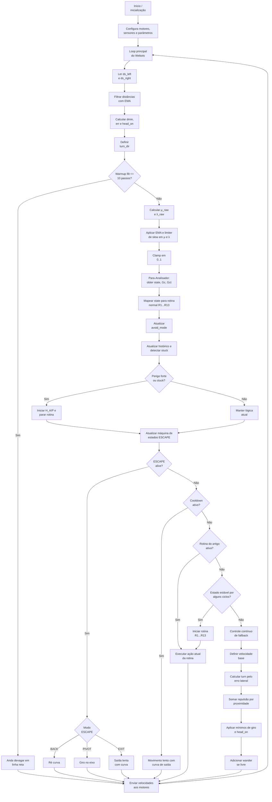

# Robô Emmy - Parte 1 (Webots)

Implementação em Webots do exemplo **"Robô Emmy - Parte 1"**, vinculada ao livro **Aplicações de LPA2v**.

Este repositório reúne a simulação, o controlador e a documentação do exemplo, mantendo a lógica central do fluxo oficial do capítulo: leitura dos sensores, filtragem, cálculo de evidências, decisão paraconsistente, tratamento de escape, rotinas do artigo e fallback contínuo.

---

## Visão geral

O projeto foi organizado como um repositório individual dentro da coleção de exemplos do livro, seguindo a convenção:

```text
livro-aplic-lpa2v-capXX-nome-do-exemplo-parteY-tecnologia
```

Nome deste repositório:

```text
livro-aplic-lpa2v-cap01-robo-emmy-parte1-webots
```

---

## Objetivo do exemplo

Este exemplo mostra, em ambiente Webots, uma versão aplicada do **Robô Emmy - Parte 1**, destacando:

- leitura e tratamento dos sensores laterais;
- filtragem das distâncias com EMA;
- cálculo de variáveis intermediárias para navegação;
- uso do **Para-Analisador** para obter estado, `Gc` e `Gct`;
- mapeamento do estado lógico para rotinas normais;
- detecção de perigo forte e condição de `stuck`;
- ativação e atualização da máquina de estados de **ESCAPE**;
- uso combinado de rotina, cooldown e fallback contínuo;
- envio final das velocidades aos motores.

---

## Diagrama do fluxo oficial do exemplo

O Mermaid abaixo foi escrito para acompanhar o **fluxo oficial do livro**, preservando a mesma sequência lógica principal e a mesma nomenclatura central dos blocos, mas com quebras de linha nos rótulos para evitar cortes na renderização do GitHub.



---

## Como interpretar o diagrama

### 1. Inicialização e loop principal

A execução começa com a inicialização do controlador, configuração dos motores, sensores e parâmetros, e entrada no loop principal do Webots.

### 2. Leitura, filtragem e variáveis geométricas

Dentro do loop, o controlador lê `ds_left` e `ds_right`, filtra as distâncias com EMA e calcula grandezas como `dmin`, `err` e `head_on`, além de definir `turn_dir`.

### 3. Warmup inicial

Nos primeiros passos, o sistema mantém um comportamento mais simples e conservador, andando devagar em linha reta.

### 4. Cálculo das evidências e análise paraconsistente

Depois do warmup, o controlador calcula `μ_raw` e `λ_raw`, suaviza esses sinais, aplica limites e executa o **Para-Analisador**, que fornece `state`, `Gc` e `Gct`.

### 5. Rotina normal, avoid mode e stuck

O estado produzido pelo analisador é mapeado para rotinas normais (`R1...R13`). Em seguida, o sistema atualiza `avoid_mode`, mantém histórico e verifica situações de perigo forte ou de travamento (`stuck`).

### 6. Máquina de estados ESCAPE

Se houver perigo forte ou `stuck`, o sistema interrompe a rotina e atualiza a máquina de estados de **ESCAPE**. Quando o escape está ativo, a ação aplicada depende do modo selecionado:

- `BACK` → ré curva;
- `PIVOT` → giro no eixo;
- `EXIT` → saída lenta com curva.

### 7. Cooldown, rotina do artigo e fallback

Quando o escape não está ativo, o fluxo avalia:

- se o sistema está em **cooldown**;
- se existe uma **rotina do artigo** ativa;
- se já há **estado estável** para iniciar uma nova rotina;
- ou se deve usar o **controle contínuo de fallback**.

No fallback contínuo, a velocidade final é obtida a partir de uma sequência de etapas: velocidade base, turn pelo erro lateral, repulsão por proximidade, mínimos de giro/head_on e wander quando o espaço está livre.

### 8. Envio de velocidades

Independentemente do ramo seguido, o fluxo converge para o envio das velocidades aos motores e então retorna ao loop principal do Webots.

---

## Estrutura do repositório

```text
.
├── .github/
├── assets/
├── controllers/
│   └── drive_my_robot/
│       └── drive_my_robot.py
├── docs/
├── libraries/
├── plugins/
├── protos/
├── worlds/
├── .gitignore
├── CHANGELOG.md
├── CITATION.cff
├── CODE_OF_CONDUCT.md
├── CONTRIBUTING.md
├── IMPORTAR_NO_GITHUB.md
├── LICENSE
├── README.md
└── SECURITY.md
```

---

## Como executar

1. Abra o projeto no Webots.
2. Carregue o mundo correspondente dentro da pasta `worlds/`.
3. Verifique se o controlador configurado é `controllers/drive_my_robot/drive_my_robot.py`.
4. Execute a simulação.
5. Observe o comportamento do robô no loop de navegação, na ativação de escape e na lógica de fallback.

---

## Arquivo principal do controlador

Arquivo principal:

```text
controllers/drive_my_robot/drive_my_robot.py
```

Esse arquivo concentra a lógica de leitura de sensores, cálculo das evidências, chamada do analisador, escolha de rotinas, gerenciamento do escape e envio de velocidades aos motores.

---

## Relação com o livro

Este repositório corresponde a um exemplo individual de um conjunto maior de exemplos do livro. A intenção é manter cada exemplo isolado, reutilizável e versionável, sem perder a coerência com a organização global da obra.

---

## Licença

Consulte o arquivo `LICENSE`.

---

## Citação

Se este repositório for usado em material acadêmico, consulte o arquivo `CITATION.cff`.
