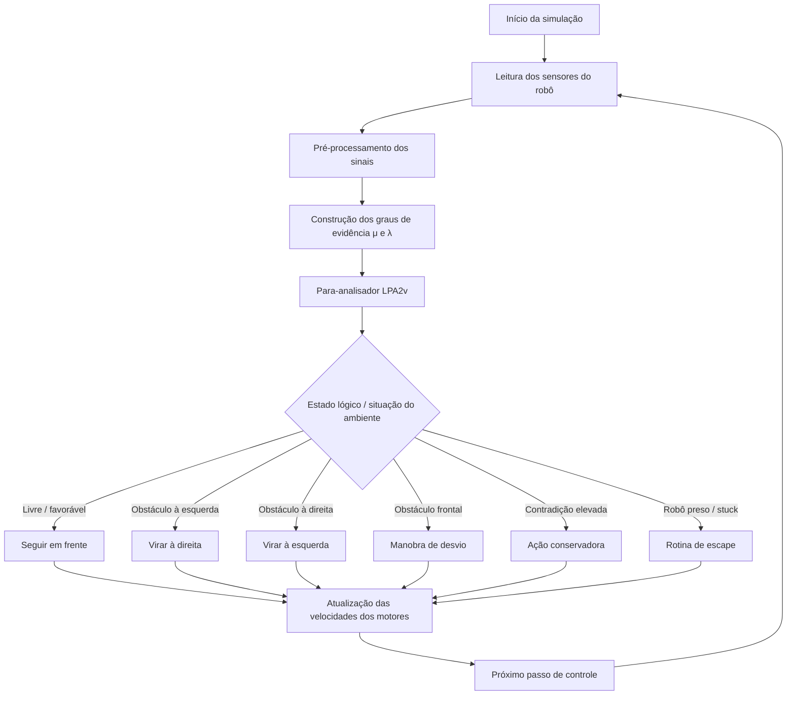

# Exemplo de Aplicação: Robô Emmy – Parte 1 (Webots)

Implementação em **Webots** do exemplo **“Exemplo de Aplicação: Robô Emmy – Parte 1”**, vinculado ao **Capítulo 1 – Para-analisadores** do livro **Aplicações de LPA2v**.

Este repositório reúne o projeto do exemplo em formato publicável, com:

- controlador principal em Python;
- mundo do Webots;
- arquivos auxiliares do projeto;
- documentação técnica e de uso;
- arquivos de apoio para publicação no GitHub.

---

## Visão geral

A proposta deste exemplo é mostrar, de forma prática e didática, como conceitos da **LPA2v** podem ser aplicados a um problema de **robótica móvel autônoma** em ambiente simulado.

O fluxo geral do projeto conecta:

1. leitura de sensores do robô;
2. construção dos graus de evidência;
3. análise lógica por meio do **Para-Analisador**;
4. decisão de movimento com base no estado lógico resultante;
5. atuação nos motores dentro do Webots.

A implementação atual é uma **releitura didática inspirada no Robô Emmy I**, preservando o núcleo lógico do exemplo original e incorporando mecanismos complementares de robustez para simulação moderna, como:

- detecção de travamento (`stuck`);
- rotinas de escape;
- tratamento conservador em situações contraditórias;
- suavização operacional entre leituras sucessivas.

---

## Diagrama lógico do exemplo



---

## Objetivo do exemplo

Este exemplo busca demonstrar como a **LPA2v** pode ser usada como mecanismo de apoio à decisão em um robô móvel, integrando percepção, interpretação lógica e ação.

Em termos didáticos, o projeto permite observar:

- como sensores podem ser convertidos em evidências;
- como essas evidências são interpretadas por uma estrutura lógica;
- como estados lógicos podem ser associados a ações motoras;
- como decisões conservadoras podem ser úteis em cenários contraditórios;
- como uma arquitetura simples pode ser explicada de forma reproduzível em simulação.

---

## Estrutura do repositório

```text
.
├── .github/
├── assets/
│   └── previews/
├── controllers/
│   └── drive_my_robot/
│       └── drive_my_robot.py
├── docs/
│   ├── book-context.md
│   ├── project-overview.md
│   └── repository-structure.md
├── libraries/
├── plugins/
│   ├── physics/
│   ├── remote_controls/
│   └── robot_windows/
├── protos/
├── worlds/
│   ├── empty_emmy_v15_fov180.wbt
│   ├── .empty_emmy_v15.wbproj
│   ├── .empty_emmy_v15_fov180.wbproj
│   └── arquivos auxiliares de mundo
├── .gitignore
├── CHANGELOG.md
├── CITATION.cff
├── CODE_OF_CONDUCT.md
├── CONTRIBUTING.md
├── IMPORTAR_NO_GITHUB.md
├── LICENSE
├── README.md
└── SECURITY.md
```

---

## Arquivos principais

### Controlador principal

```text
controllers/drive_my_robot/drive_my_robot.py
```

Esse arquivo concentra a lógica de controle do exemplo. De forma geral, ele:

- lê os sensores do robô;
- processa os sinais relevantes para navegação;
- calcula valores associados à evidência;
- trabalha com variáveis como `Gc` e `Gct`;
- associa estados lógicos a rotinas de movimento;
- aplica camadas de segurança para evitar comportamentos indesejados.

### Mundo principal

```text
worlds/empty_emmy_v15_fov180.wbt
```

Esse é o ambiente principal do exemplo no Webots.

---

## Lógica geral do controlador

O comportamento do robô pode ser entendido em quatro blocos:

### 1. Percepção
O robô lê informações dos sensores para inferir a condição do ambiente ao redor.

### 2. Construção de evidência
As leituras são tratadas para compor graus de evidência favorável e desfavorável.

### 3. Análise lógica
Os valores são interpretados no domínio lógico da **LPA2v**, produzindo indicadores que orientam a decisão.

### 4. Ação motora
O estado resultante é convertido em ação: avançar, virar, desviar, recuar ou escapar.

---

## Como executar

### 1. Abra o projeto no Webots
Abra o arquivo abaixo no Webots:

```text
worlds/empty_emmy_v15_fov180.wbt
```

### 2. Verifique o controlador
O mundo está configurado para utilizar o controlador:

```text
controller "drive_my_robot"
```

### 3. Inicie a simulação
Ao executar a simulação, o controlador Python será carregado automaticamente.

### 4. Observe o console
Durante a execução, o console pode exibir informações úteis de depuração, como:

- leituras dos sensores;
- valores de `μ` e `λ`;
- estado lógico atual;
- `Gc` e `Gct`;
- rotina nominal e rotina efetivamente aplicada;
- indicadores como `escape`, `avoid` e `stuck`.

---

## Requisitos

Para executar este exemplo, recomenda-se:

- **Webots R2025a** ou versão compatível com o mundo fornecido;
- Python integrado ao próprio Webots;
- ambiente capaz de abrir projetos `.wbt`.

Este exemplo não exige, em princípio, instalação adicional de bibliotecas externas via `pip`.

---

## Organização dentro da coleção do livro

Este repositório foi concebido como **um repositório individual dentro de uma coleção maior de exemplos do livro**.

A convenção adotada para os repositórios é:

```text
livro-aplic-lpa2v-capXX-nome-do-exemplo-parteY-tecnologia
```

Nome oficial deste repositório:

```text
livro-aplic-lpa2v-cap01-robo-emmy-parte1-webots
```

Essa organização facilita:

- padronização entre capítulos;
- crescimento da coleção de exemplos;
- manutenção de repositórios independentes;
- associação clara entre capítulo, exemplo e tecnologia.

---

## Publicação no GitHub

Este repositório já inclui arquivos úteis para publicação aberta e organizada no GitHub:

- `LICENSE`
- `README.md`
- `CITATION.cff`
- `CONTRIBUTING.md`
- `CODE_OF_CONDUCT.md`
- `SECURITY.md`
- `.github/`

As instruções complementares de envio e organização estão em:

```text
IMPORTAR_NO_GITHUB.md
```

---

## Como citar

Use o arquivo `CITATION.cff` ou adapte a referência abaixo:

```bibtex
@software{miranda_cortes_santos_emmy_webots,
  author  = {Hyghor Miranda Côrtes and Paulo Santos},
  title   = {Exemplo de Aplicação: Robô Emmy - Parte 1 (Webots)},
  year    = {2026},
  version = {1.0.0},
  note    = {Repositório: livro-aplic-lpa2v-cap01-robo-emmy-parte1-webots}
}
```

---

## Contribuições

Sugestões de melhoria, correções e extensões são bem-vindas.

Leia antes:

- `CONTRIBUTING.md`
- `CODE_OF_CONDUCT.md`

---

## Limitações e escopo

Este repositório tem foco **didático e acadêmico**.

Ele foi estruturado para:

- apoiar o estudo de LPA2v aplicada;
- documentar um exemplo reproduzível em Webots;
- servir de base para outros exemplos do livro.

Dependendo da evolução do projeto, versões futuras podem incluir:

- novas variações do cenário;
- diagramas adicionais;
- vídeos ou animações de demonstração;
- documentação mais detalhada do controlador.

---

## Licença

Este projeto está distribuído sob a licença **MIT**.

Consulte o arquivo `LICENSE` para os detalhes.
